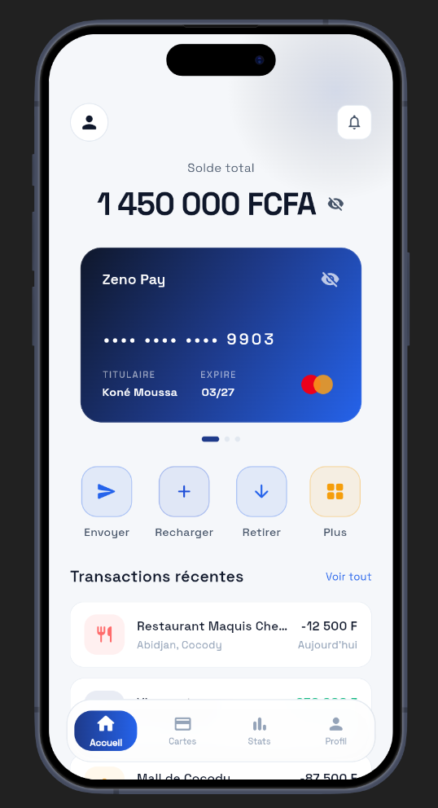
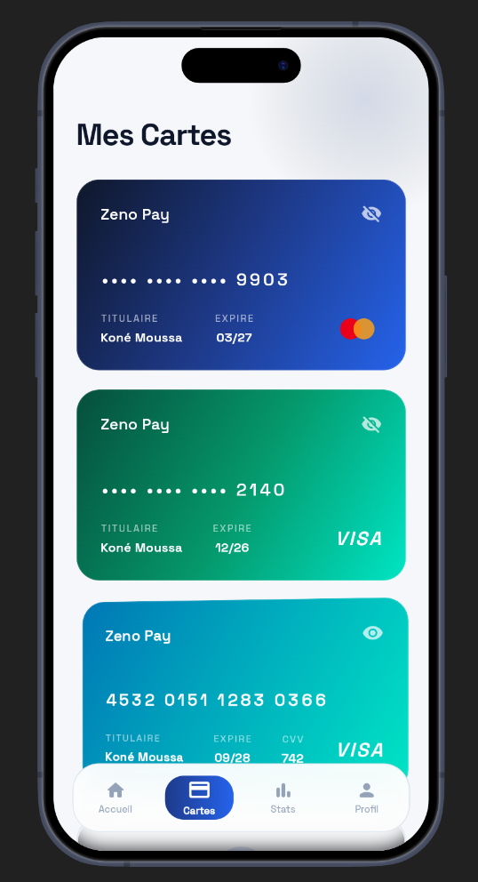
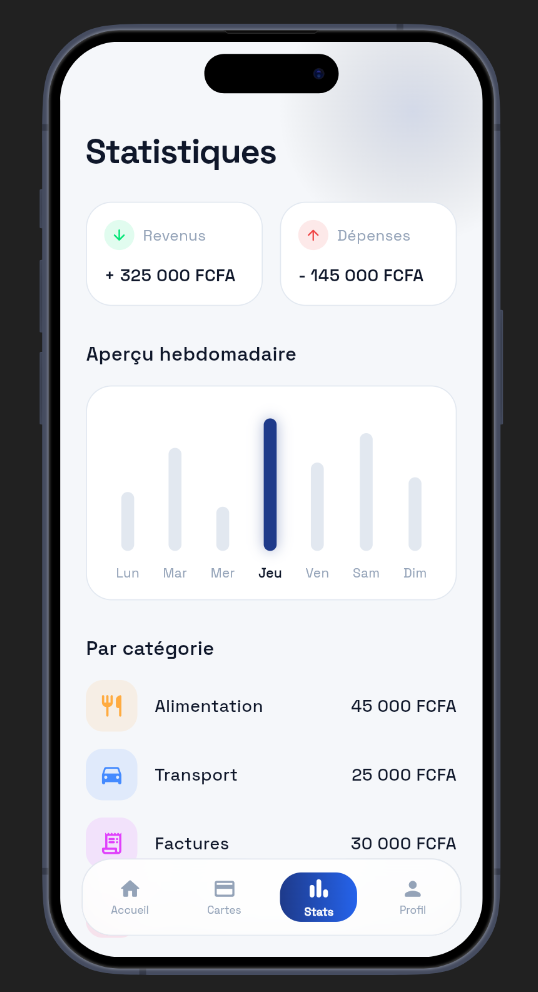
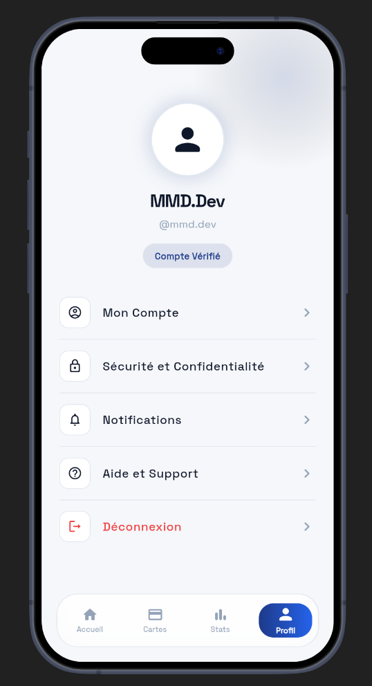

# Zeno Pay — Mobile Financial & Digital Wallet App

A **next-generation digital wallet & financial management mobile application** built with Flutter and Dart, featuring multi-country phone authentication across West Africa, virtual & physical card management, real-time balance privacy controls, transaction analytics, and dedicated user profile management.

---

## Features

- Multi-country phone authentication tailored for West Africa with strict per-country digit length validation (Côte d'Ivoire, Sénégal, Mali, Burkina Faso)
- Interactive virtual & physical Visa & Mastercard carousel with animated 3D card flip effects, real-time balance tracking, and secure card detail masking/unmasking
- Comprehensive 4-tab IndexedStack dashboard architecture ensuring smooth state persistence between Home, Cards, Stats, and Profile tabs
- Financial analytics & weekly expense overview with interactive breakdown charts and category tracking in XOF
- Security & privacy controls including instant balance visibility toggle, 6-digit PIN verification, and OTP authentication flow
- Minimalist animated splash screen with modern geometric Space Grotesk typography and smooth page transitions
- Premium dark glassmorphism design system featuring royal blue accent gradients, custom bottom navigation bar, and zero layout overflow

---

## Technologies Used

- **Flutter SDK** – Cross-platform framework for building native mobile applications
- **Dart** – High-performance language powering the app logic and UI components
- **Provider** – Reactive state management driving the dashboard tabs, auth lifecycle, and card interactions
- **Google Fonts (Space Grotesk)** – Modern geometric typography system across all screens and components
- **Material 3 & Custom Glassmorphism** – Modern UI design with smooth backdrop filters and responsive layouts

---

## Preview

  
  

  
  

